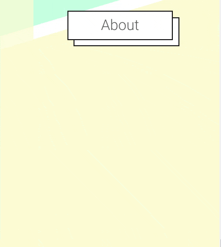

# React Button Navbar

Navigation menu for React.js 

## Installation

```bash
npm install --save react-button-navbar
yarn add react-button-navbar
```




## Usage

```javascript
import React,{useState} from 'react'
import Select, { Option } from 'react-button-navbar';

function App(){
  const [current, setCurrent] = useState("opt1")
  return (
    <Select currentValue={current} onSelect={(value)=>{setCurrent(value)}} >
      <Option value="opt1">Option 1</Option>
      <Option value="opt2">Option 2</Option>
      <Option value="opt3">Option 3</Option>
      <Option value="opt4">Option 4</Option>
    </Select>
  )
}

export default App
```

## Contributing
Pull requests are welcome. For major changes, please open an issue first to discuss what you would like to change.

Please make sure to update tests as appropriate.

## License
[MIT](https://choosealicense.com/licenses/mit/)